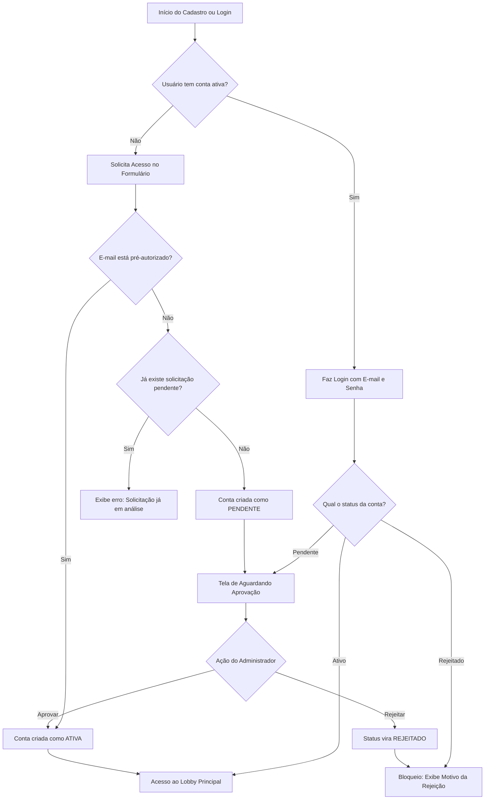

# Manual do Usuário — Central de Autenticação +BET

Este manual documenta o funcionamento e as regras de negócio dos processos de **Cadastro (Solicitação de Acesso)**, **Login** e **Recuperação de Senha** do sistema de bolões **+BET**. Ele foi escrito em linguagem clara para o usuário final, com notas técnicas sobre as regras do sistema.

---

## 📌 Sumário
1. [Fluxo de Cadastro e Solicitação de Acesso](#1-fluxo-de-cadastro-e-solicitação-de-acesso)
2. [Fluxo de Login e Estados de Conta](#2-fluxo-de-login-e-estados-de-conta)
3. [Recuperação de Senha (Esqueci a Senha)](#3-recuperação-de-senha-esqueci-a-senha)
4. [Diagrama do Fluxo de Autenticação](#4-diagrama-do-fluxo-de-autenticação)

---

## 1. Fluxo de Cadastro e Solicitação de Acesso

Caso você ainda não possua acesso ao **+BET**, deverá solicitar sua participação preenchendo o formulário de cadastro.

### 📝 Passo a Passo para se Cadastrar:
1. Acesse a tela inicial do sistema.
2. Na parte inferior do formulário, clique em **"NÃO TEM CONTA? SOLICITE ACESSO"**.
3. Preencha as informações solicitadas:
   * **Nome Completo** *(Obrigatório)*: Seu nome oficial para exibição no ranking e nos palpites.
   * **Seu E-mail** *(Obrigatório)*: Endereço de e-mail que você usará para fazer login.
   * **Sua Senha** *(Obrigatório)*: Deve conter **no mínimo 6 caracteres**.
   * **Telefone / WhatsApp** *(Opcional)*: Campo formatado automaticamente no padrão `(XX) XXXXX-XXXX` para contatos da organização do bolão.
   * **Cidade e UF** *(Opcional)*: Sua localização geográfica.
   * **Mensagem** *(Opcional)*: Mensagem de justificativa para o administrador do bolão (ex: *"Fui convidado por Fulano"*).
4. Clique em **"ENVIAR SOLICITAÇÃO"**.

---

### ⚙️ Regras de Negócio e Validações de Cadastro:

Quando você envia o formulário de cadastro, o sistema processa a sua solicitação com base em três cenários:

#### **Cenário A: E-mail Pré-Autorizado**
* Se o administrador já tiver colocado o seu e-mail na lista de e-mails permitidos antes de você se cadastrar, a sua conta será criada como **Ativa** imediatamente.
* Você será logado de forma automática e redirecionado para a página principal (`/`) do sistema, já podendo fazer palpites nos campeonatos vigentes.

#### **Cenário B: Nova Solicitação (Sem Pré-Autorização)**
* Se o seu e-mail não estiver na lista de pré-autorizados, o sistema criará sua conta com o status **Pendente**.
* Uma solicitação de acesso será gerada na fila do administrador contendo todas as informações que você preencheu (nome, e-mail, telefone, localização e mensagem).
* Você será conectado e redirecionado automaticamente para a página de **Aguardando Aprovação** (`/aguardando-aprovacao`).

#### **Cenário C: Erros e Duplicidades**
* **Solicitação Duplicada**: Se você tentar se cadastrar com um e-mail que já possui uma solicitação em análise pelo administrador, o sistema exibirá: 
  > ⚠️ *Você já possui uma solicitação pendente. Aguarde a análise do administrador.*
* **E-mail já Registrado**: Se você tentar cadastrar um e-mail que já possui uma conta ativa no banco de dados, o sistema exibirá:
  > ⚠️ *Já existe uma conta com este e-mail. Tente fazer login.*
* **Senha Muito Curta**: O sistema impede o cadastro se a senha inserida possuir menos de 6 caracteres.

---

## 2. Fluxo de Login e Estados de Conta

Se você já possui uma conta criada, pode entrar no sistema inserindo seu **E-mail Autorizado** e **Sua Senha** na tela inicial de login e clicando em **"ENTRAR AGORA"**.

O seu acesso ao sistema depende diretamente do **status atual** da sua conta, definido pelo administrador do bolão:

| Status da Conta | O que acontece ao logar? | Funcionalidades Disponíveis |
| :--- | :--- | :--- |
| 🟢 **Ativo** | Redirecionado diretamente para o Lobby Principal (`/`). | Acesso completo para realizar palpites, ver ranking em tempo real, regulamento e classificação dos campeonatos. |
| 🟡 **Pendente** | Redirecionado para a página de **Aguardando Aprovação** (`/aguardando-aprovacao`). | **Acesso de leitura**: Permite explorar os campeonatos ativos, ver as regras de pontuação e premiações gerais. **Não** permite fazer palpites ou interagir com o ranking. |
| 🔴 **Rejeitado** | Bloqueado na própria tela de login com o aviso **"SOLICITAÇÃO REJEITADA"**. | Nenhum acesso permitido. A tela exibe o motivo específico da rejeição e um botão para sair ou tentar um novo e-mail. |

> [!TIP]
> **Atualização Automática de Status:** A página de espera (`/aguardando-aprovacao`) consulta automaticamente o servidor a cada **30 segundos**. Se o administrador aprovar a sua conta enquanto você está nessa página, você será redirecionado para a área de jogos de forma instantânea, sem precisar atualizar a janela manualmente.

---

## 3. Recuperação de Senha (Esqueci a Senha)

Caso não se lembre da sua senha cadastrada, você poderá redefini-la de forma autônoma através de um código de verificação temporário enviado ao seu e-mail.

### 🔑 Passo a Passo para Redefinir a Senha:
1. Na tela de login, clique no botão **"Esqueceu a senha?"** localizado logo acima do campo de senha.
2. Insira o seu e-mail cadastrado e clique em **"ENVIAR E-MAIL DE RECUPERAÇÃO"**.
3. O sistema enviará um código numérico de uso único (OTP) com **8 dígitos** para o seu e-mail.
4. Digite esse código de 8 dígitos no campo exibido na tela do +BET.
5. Após o código ser verificado com sucesso pelo servidor, você será redirecionado para a página **Criar Nova Senha** (`/alterar-senha`).
6. Insira a nova senha desejada e confirme-a no campo correspondente.
7. Clique em **"DEFINIR NOVA SENHA"**. Você será logado na conta e direcionado ao Lobby Principal.

> [!WARNING]
> **Tempo Limite de Segurança (Rate Limit):** Para evitar disparos em massa, você só poderá solicitar o envio de um e-mail de recuperação a cada **60 segundos**. Caso tente enviar mais de uma vez dentro deste período, o sistema exibirá uma mensagem de erro temporário solicitando que você aguarde.

> [!IMPORTANT]
> A nova senha cadastrada deve conter pelo menos **6 caracteres** e deve ser **diferente da senha antiga** cadastrada anteriormente.

---

## 4. Diagrama do Fluxo de Autenticação

Para melhor visualização de como o sistema lida com o seu cadastro e aprovação, veja o fluxo abaixo:

---

*Manual atualizado para o sistema +BET v4.1.0.*
